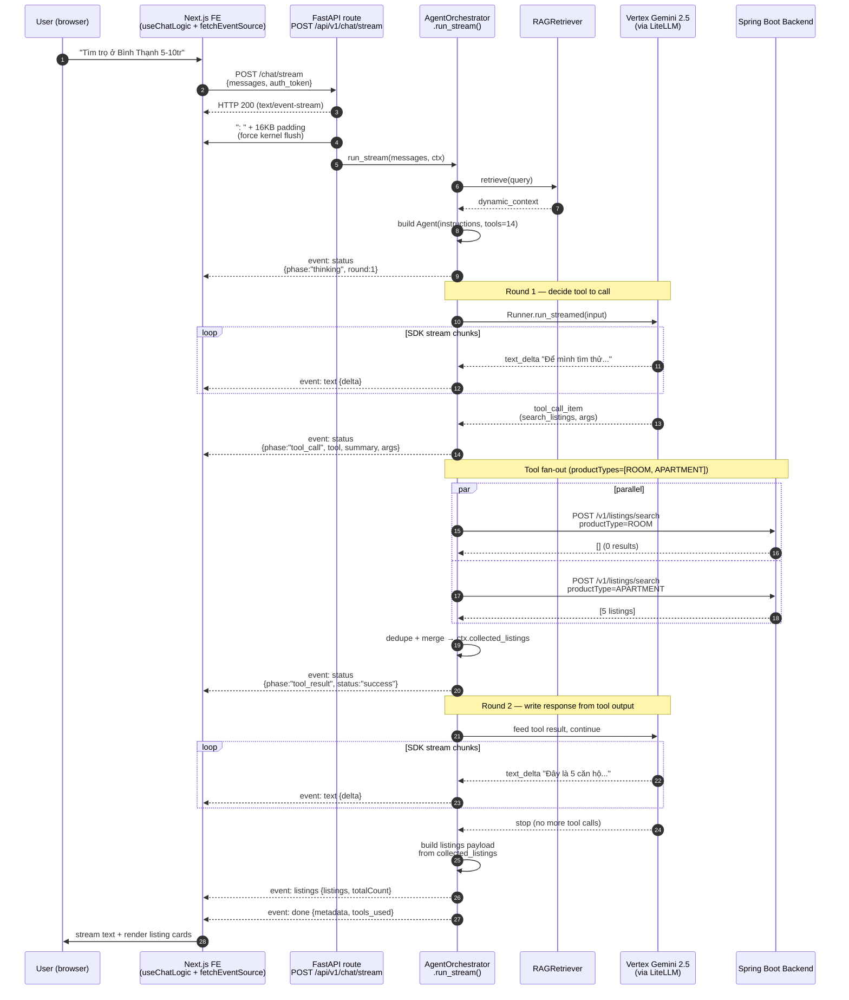

# 02 — SSE Streaming Sequence

Lifecycle of a single chat request from user keystroke to listings
rendered in the chat bubble. The headline contribution is that
**text streams continuously** even though the underlying agent loop
makes multiple round-trips to the LLM and the backend.

## Notes

- **Padding event #0 is load-bearing.** The 16KB SSE comment at the
  start defeats Windows uvicorn's kernel send-buffer accumulation;
  without it the FE's `onopen` doesn't fire until ~5s into the
  request.
- **`status` events carry rich `summary` + `args`** (sprint v2). FE
  renders "Đang tìm BĐS: quận 765 phòng/căn hộ giá 5-10tr..." instead
  of a generic spinner.
- **Tool fan-out is the productTypes contribution.** A single user
  utterance maps to N parallel HTTP calls when the Vietnamese term is
  ambiguous (`nhà trọ` → `[ROOM, APARTMENT]`). Dedupe is by
  listingId; totalCount aggregates conservatively.
- **Round 2 starts immediately after the tool result event** — the
  text gap there is just the LLM TTFT (2-3s with thinking disabled,
  see [03-agent-dispatch.md](./03-agent-dispatch.md)).
- **`listings` event is currently emitted once at the end.**
  Progressive per-card emit is on the Phase 2 polish list.
- **Cancel path** (`useChatLogic.cancelStream`): FE aborts the SSE
  connection; AI orchestrator catches `asyncio.CancelledError` and
  cleanly tears down `Runner.run_streamed`.
