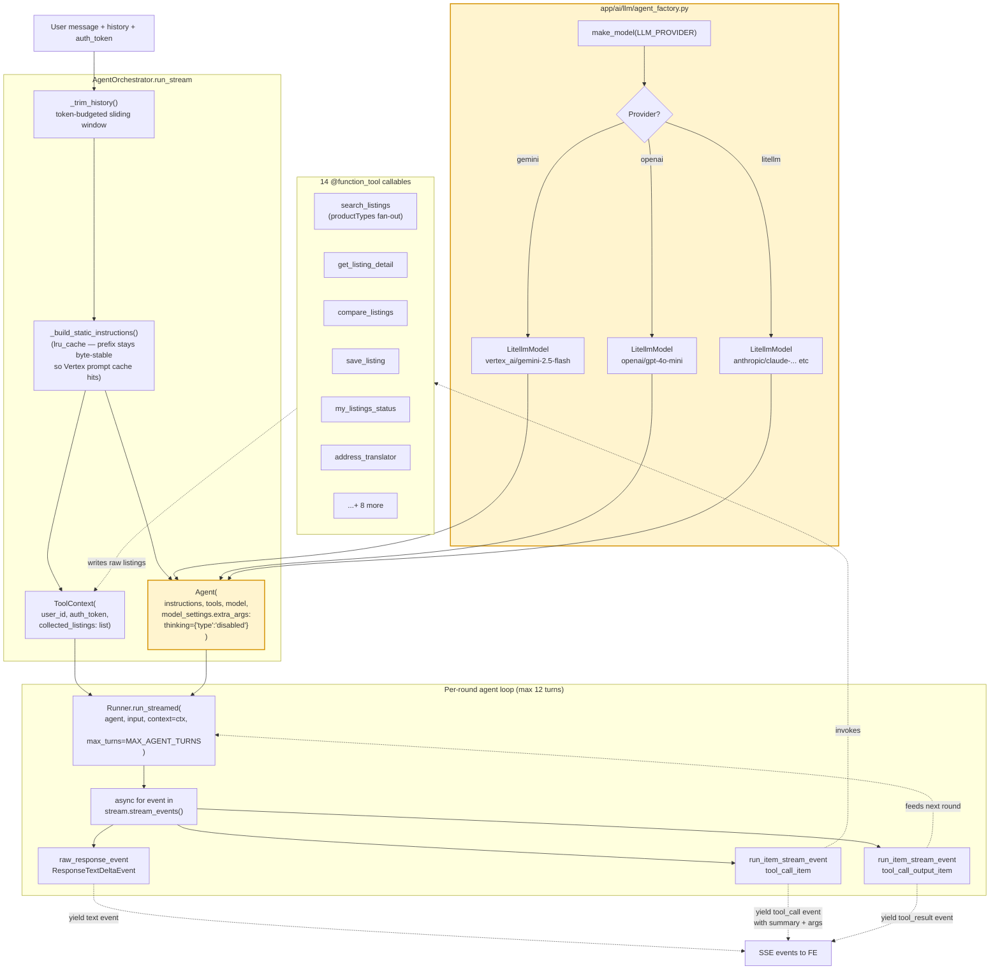

# 03 — Agent Dispatch Flow

The agent loop in `AgentOrchestrator.run_stream` plus the wiring that
makes it provider-pluggable. This is the **core thesis contribution
diagram** — labelled letters in the agent box map to the four
contribution bullets in the defense slide deck.

## Contribution mapping

The four thesis contributions surface in this diagram as labelled
components:

1. **Provider-pluggable LLM** — entire `Factory` subgraph. Switching
   provider is a single env var; the `Agent` node above takes
   whatever `Model` `make_model()` returns. No conditionals in
   orchestrator code.

2. **Vietnamese-aware tool dispatch** — inside `Tools` →
   `search_listings`. The fan-out is invisible from orchestrator's
   point of view (still one tool_call_item), but the tool itself
   issues N parallel backend calls and merges. Same shape works for
   "nhà trọ" (2 types), "thuê nhà" (3 types), or exact terms (1
   type, collapses to single call).

3. **Streaming UX** — the three event types from `EventStream`. We
   route `text_delta` immediately (pre-tool ACK), and decorate
   `tool_call_item` with a friendly summary + sanitised args before
   yielding to the FE. `thinking={'type':'disabled'}` in `Agent`'s
   `model_settings.extra_args` is the line that fixed the 9-second
   silent gap before round 2's first token.

4. **Legacy/new address bridging** — surfaces via `address_translator`
   in `Tools` and inside the args passed to `search_listings`. The
   actual mapping happens on the backend (see
   [04-address-bridging.md](./04-address-bridging.md)); the AI side
   contribution is declaring legacy vs new in the tool's pydantic
   field descriptions so the LLM picks the right one.

## Notes

- **`MAX_AGENT_TURNS = 12`** caps the loop; one `tool_call_item` +
  one `tool_call_output_item` consumes 2 turns, so this is ~6 tool
  invocations max. Hits `MaxTurnsExceeded` if a tool oscillation
  pattern emerges (rare in production).
- **ToolContext is process-local and never crosses to the LLM.** The
  auth token, user id, and `collected_listings` list never appear in
  the model's prompt — they're plumbing for the tool implementations.
- **Tools push raw listings into `ctx.collected_listings`.** The
  orchestrator dedupes + builds the `listings` payload after the run
  completes; tools themselves return compact summaries to the LLM
  (token-budget friendly).
