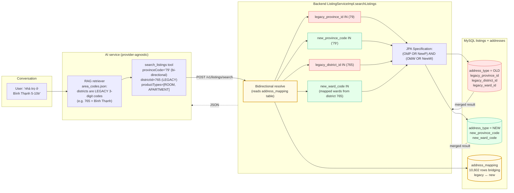

# 04 — Legacy / New Address Bridging

Vietnam reorganised administrative units on **2025-07-01**: 63
provinces → 34 provinces, and the 3-tier structure (`province →
district → ward`) collapsed to 2-tier (`province → ward`, no
districts). Listings posted before that date live under the OLD
structure; new listings use the NEW structure. The chatbot has to
search both transparently because users still refer to old district
names ("Bình Thạnh", "Quận 1") in conversation.



## Notes

- **The AI side keeps the legacy mental model.** Vietnamese users
  still say "Quận 1", "Bình Thạnh", "Cầu Giấy" — names that
  technically no longer exist. The RAG knowledge base
  (`area_codes.json`) intentionally exposes legacy district codes;
  field descriptions in `search_listings.py` document this:
  ```
  districtId: LEGACY district ID (pre-2025-07 3-tier).
  Backend reverse-maps via address_mapping.
  ```
- **`address_mapping` is the bridge.** Single table, 10,602 rows,
  populated by a one-time data migration. Maps every legacy
  `(province, district, ward)` triple to one or more new
  `(province, ward)` tuples. New wards can be 1:N with old wards
  (merges) so the mapping is many-to-many.
- **The backend builds an `OR`-shape predicate.** For each
  user-supplied legacy id, the resolver computes the new equivalents
  via `address_mapping` and ORs both branches into the JPA query.
  This means a single search query naturally matches both
  pre-reform and post-reform listings — no schema migration was
  needed on the `listings` table.
- **`address_translator` tool exists specifically to surface this
  bridge in chat.** "Bình Thạnh giờ là phường nào?" calls the
  backend's `/v1/addresses/search-new-address` endpoint and pairs
  the response with the local legacy lookup, so the model can
  answer "Bình Thạnh trước cải cách → các phường mới: …".
- **Bug from this work:** the `phonetic_title` column in the
  `listings` entity was added in PR #232 ("enhance search
  suggestion") without a Flyway migration. Every search query
  failed with `SQL 1054 Unknown column 'l1_0.phonetic_title'` for
  ~22h in production. Fix landed as
  `V76__Add_phonetic_title_to_listings.sql`. Mentioned here as a
  cautionary tale about cross-cutting schema changes.
