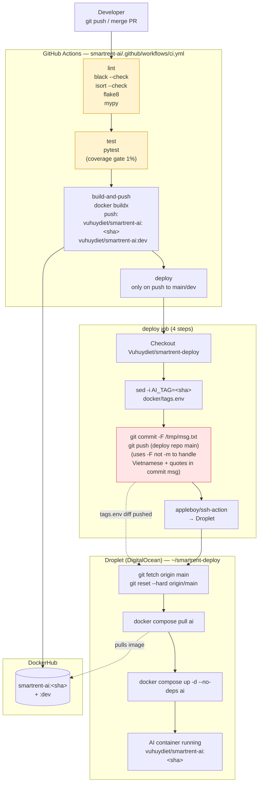

# 05 — CI/CD Pipeline

How a PR merge to `dev` becomes a running container on the Droplet.
Three jobs in series — `lint` → `test` → `build-and-push` →
`deploy` — defined in `.github/workflows/ci.yml`. The deploy job
cross-repos: it bumps a tag in `smartrent-deploy` and SSH's the
Droplet to roll the container.

## Notes

- **`build-and-push` and `deploy` only fire on push to `main`/`dev`.**
  Feature-branch CI runs lint + test only. This keeps PR feedback
  fast and avoids polluting the registry with intermediate tags.
- **`git commit -F /tmp/msg.txt`, not `-m "..."`.** PR #36 fixed an
  earlier crash where the commit message from a multi-commit merge
  contained Vietnamese strings + double quotes; bash parsed the
  quotes literally and git interpreted the remaining tokens as
  pathspecs. Reading from a file via `-F` is quote-safe.
- **Droplet `.env` is intentionally `.gitignore`-protected.** It
  holds GCP credentials, Langfuse keys, etc. — auto-deploy never
  touches it. Changing model selection (`LLM_CHAT_MODEL`) is a
  manual SSH edit. Compose passes the env through with safe defaults
  in `docker-compose.yml`.
- **Migration footgun observed during this work:** when env var
  names changed (`GEMINI_CHAT_MODEL` → `LLM_CHAT_MODEL` after the
  OpenAI-Agents-SDK migration), pydantic-settings
  `extra="ignore"` swallowed the old name silently and the service
  fell back to defaults. Compose file + Droplet `.env` had to be
  updated in lockstep. Documented in
  `memory/project_chatbot_pending_fixes.md`.
- **Healthcheck `start_period = 60s`.** Container start runs
  `uv sync` inline before the FastAPI app boots, which takes
  30-45s. The first health probe will fail; that's why the period
  exists. The container shows `unhealthy → healthy` once `Uvicorn
  running on http://0.0.0.0:8000` appears in logs.
